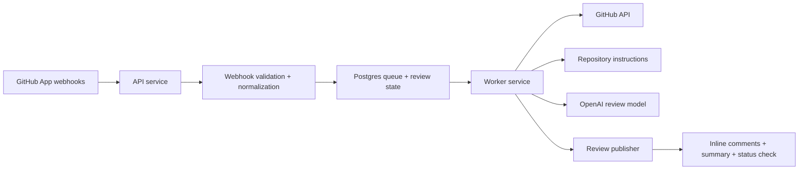

# nitpickr

<p align="center">
  
</p>

<p align="center">
  Source-available, self-hosted AI code review for GitHub pull requests.
</p>

`nitpickr` runs as a GitHub App, reads the PR diff plus repository
instructions, calls an LLM for review output, and publishes inline comments, a
summary, and a `nitpickr / review` status check.

## Status

- Provider support today: GitHub App only
- Runtime shape: API service + worker service + Postgres
- Lowest-cost setup: local Docker Compose + public HTTPS tunnel
- Easiest hosted setup: Railway
- License: source-available, commercial internal use allowed, managed service
  restricted

The project is local-first on purpose:

- run it on your machine with Docker Compose for the lowest ongoing cost
- move it to Railway if you want an always-on public webhook endpoint
- keep the reviewed repository in control of its own instructions and review
  policy

Internal commercial use is allowed. Running `nitpickr` itself as a hosted or
managed service is not. See [LICENSE](LICENSE) and [TRADEMARKS.md](TRADEMARKS.md)
for details.

## Features

- Lowest-cost path: local Docker + a public HTTPS tunnel means you mainly pay
  for model usage.
- Small-team friendly: repository-specific instructions live in
  `.nitpickr.yml`, `.nitpickr/`, and `AGENTS.md`.
- Operationally simple: one API service, one worker service, one Postgres
  database.
- Review output includes inline comments, a summary, and a GitHub status check.
- Manual commands let authors request review, summary, recheck, and follow-up
  explanations directly from the PR conversation.
- Cost-aware by default: `gpt-5-mini` is a strong default for review quality
  per dollar, and you can switch to larger or cheaper models at any time.
- Designed to grow: GitHub is first, but the internals are already split in a
  way that can support more SCM providers and more model providers later.

## Architecture



At a high level:

1. GitHub sends a webhook to `/webhooks/github`.
2. The API validates the signature, normalizes the event, and queues review
   work in Postgres.
3. The worker claims the job, fetches the PR context, loads repo instructions,
   and calls the configured model.
4. The publisher writes the review back to GitHub as inline comments, a summary
   body, and a status check.
5. Feedback and review memory stay in Postgres and remain repository-scoped.

More background is available in [docs/architecture-plan.md](docs/architecture-plan.md).

## Getting Started

### Requirements

- Node.js `>=20.9.0`
- `pnpm` `10`
- Docker and Docker Compose for the easiest local run
- a GitHub account or organization where you can create a GitHub App
- an OpenAI API key
- a public HTTPS URL for GitHub webhooks
  - local: use a tunnel such as `cloudflared` or `ngrok`
  - hosted: use the public Railway domain

### Quickstart

This is the recommended path for most people evaluating `nitpickr`.

1. Clone the repo and install dependencies.

   ```bash
   corepack enable
   pnpm install
   ```

2. Copy the environment template.

   ```bash
   cp .env.example .env
   ```

3. Create a GitHub App and gather the required values.

   Use [docs/github-app.md](docs/github-app.md) for the full walkthrough.

4. Start a public HTTPS tunnel that points to `http://localhost:3000`.

   Important: the public tunnel origin must be used for both
   `NITPICKR_BASE_URL` and `NITPICKR_WEBHOOK_URL`. Do not leave
   `NITPICKR_BASE_URL` at `localhost`, because the app derives its webhook URL
   from the base URL.

5. Fill in `.env`.

   The required values are documented in the next section. For local Docker
   Compose, you can keep the default `DATABASE_URL` because it is already wired
   to the bundled Postgres container.

6. Validate the setup.

   ```bash
   set -a
   source .env
   set +a
   pnpm cli doctor
   ```

7. Start the local stack.

   ```bash
   docker compose up --build
   ```

8. Verify the service.

   ```bash
   curl http://localhost:3000/healthz
   curl http://localhost:3000/readyz
   ```

9. Install the GitHub App on a repository, open a PR, and comment
   `@nitpickr review`.

## Configuration

### Environment variables

`.env.example` is the source of truth. These are the values most users need to
understand first:

| Variable | Required | Where it comes from | Notes |
| --- | --- | --- | --- |
| `DATABASE_URL` | Yes | Local Postgres or Railway Postgres | The local example already targets the bundled Compose database. |
| `NITPICKR_BASE_URL` | Yes | Your public HTTPS base URL | Local: your tunnel origin. Railway: your API service public domain. |
| `NITPICKR_WEBHOOK_URL` | Yes for local setup and `doctor` | `NITPICKR_BASE_URL` + `/webhooks/github` | GitHub webhook target. |
| `NITPICKR_SECRET_KEY` | Recommended | Generate with `openssl rand -hex 32` | Enables encrypted persisted runtime secrets. |
| `OPENAI_API_KEY` | Yes | [OpenAI API keys](https://platform.openai.com/api-keys) | Required for review generation. |
| `OPENAI_MODEL` | Yes | Your chosen OpenAI model | Start with `gpt-5-mini`. |
| `GITHUB_APP_ID` | Yes | GitHub App settings page | Numeric app ID. |
| `GITHUB_PRIVATE_KEY` | Yes | GitHub App private key download | Paste the PEM directly or with `\n` escapes. |
| `GITHUB_WEBHOOK_SECRET` | Yes | A secret you choose in GitHub App settings | Must match the value configured in the GitHub App. |
| `GITHUB_BOT_LOGINS` | Recommended | Usually your GitHub App name(s) | Comma-separated mention handles without `@`. |

Useful optional settings:

- `NITPICKR_LOG_LEVEL=debug` for first-run troubleshooting
- `NITPICKR_WORKER_CONCURRENCY=4` for default worker parallelism
- `NITPICKR_REPOSITORY_ALLOWLIST=owner/repo-a,owner/repo-b` to limit which
  repos the instance may review
- `NITPICKR_PROMPT_OPTIMIZATION_MODE=balanced` to keep prompt sizes under
  control on larger PRs

### Model guidance

Recommended starting point:

- `OPENAI_MODEL=gpt-5-mini`

Why:

- it is materially cheaper than flagship GPT-5-tier models
- it still produces useful review comments for most small and medium PRs
- it keeps self-hosting costs reasonable for indie teams

Practical guidance:

- use `gpt-5-mini` first unless you already know you need the strongest model
- if your account does not have access to `gpt-5-mini`, set `OPENAI_MODEL` to
  another supported model such as `gpt-4.1`
- move to a larger GPT-5-family model if you want deeper reasoning and are
  comfortable paying more per review
- try a cheaper model only if you are intentionally optimizing for cost and can
  tolerate lower recall

Check the latest official model and pricing pages before locking in a hosted
budget:

- [OpenAI models](https://platform.openai.com/docs/models)
- [OpenAI API pricing](https://openai.com/api/pricing/)

## Development

### Local development loop

Use Docker Compose for end-to-end validation. For faster code iteration, run
the processes directly after exporting the `.env` file into your shell:

```bash
set -a
source .env
set +a
pnpm migrate
pnpm dev:api
```

In a second terminal:

```bash
set -a
source .env
set +a
pnpm dev:worker
```

### Useful commands

```bash
pnpm lint
pnpm typecheck
pnpm test
pnpm cli doctor
pnpm cli migrate
pnpm dev:api
pnpm dev:worker
pnpm eval:reviews
```

## Usage

### GitHub App setup

Use the full guide in [docs/github-app.md](docs/github-app.md).

The short version:

- create a GitHub App
- set the webhook to `https://YOUR_PUBLIC_HOST/webhooks/github`
- generate a private key
- install the app on the repositories you want reviewed
- grant these permissions:
  - Pull requests: Read and write
  - Contents: Read-only
  - Issues: Read and write
  - Checks: Read and write
  - Metadata: Read-only
- subscribe to these events:
  - Pull request
  - Issue comment

### Review commands

Default behavior:

- automatic reviews can run on PR `opened`, `synchronize`, and
  `ready_for_review` events
- repositories can tune review behavior with `.nitpickr.yml`
- instructions can also come from `.nitpickr/` and `AGENTS.md`

Manual review commands in PR comments:

- `@nitpickr review`
- `@nitpickr full review`
- `@nitpickr summary`
- `@nitpickr recheck`
- `@nitpickr ignore this`

Reply commands for an existing nitpickr review comment:

- `@nitpickr why`
- `@nitpickr teach`
- `@nitpickr fix`
- `@nitpickr reconsider`
- `@nitpickr learn <team preference>`
- `@nitpickr status`

### Repository config example

```yaml
version: 1
review:
  strictness: balanced
  maxComments: 10
  focusAreas:
    - API correctness
    - background jobs
    - migrations
```

## Deployment

If you want an always-on hosted setup, Railway is the simplest path today.

The deployed shape is:

- one public `api` service
- one private `worker` service
- one PostgreSQL database

Use [docs/railway-deploy.md](docs/railway-deploy.md) for the full walkthrough.

Cost note:

- local Docker is the cheapest long-term option because you avoid managed infra
  cost
- Railway is the easiest managed option when you want a stable public endpoint
- Railway pricing changes over time, but for early testing and small personal
  use, its trial/free-plan budget is often enough to validate the setup before
  moving to a paid plan

For operational troubleshooting, see [docs/beta-runbook.md](docs/beta-runbook.md).

## Roadmap

Near-term direction:

- support more Git providers, especially GitLab and Bitbucket
- support more model providers, including Anthropic and local/self-hosted
  models
- keep the service provider-agnostic so teams can choose the quality/cost trade
  off that fits them

## Contributing

See [CONTRIBUTING.md](CONTRIBUTING.md) for local development workflow,
verification expectations, and pull request guidelines.

## License

`nitpickr` is source-available under the
[Elastic License 2.0](https://www.elastic.co/licensing/elastic-license).

That means:

- personal and internal commercial use are allowed under the license terms
- you may not offer `nitpickr` itself to third parties as a hosted or managed
  service without a separate agreement
- you must keep licensing, copyright, and other notices intact
- this repository should still be described as source-available rather than
  OSI-approved open source

Branding is separate from the code license. See
[TRADEMARKS.md](TRADEMARKS.md) for rules covering the `nitpickr` name, logo, and
mascot.
