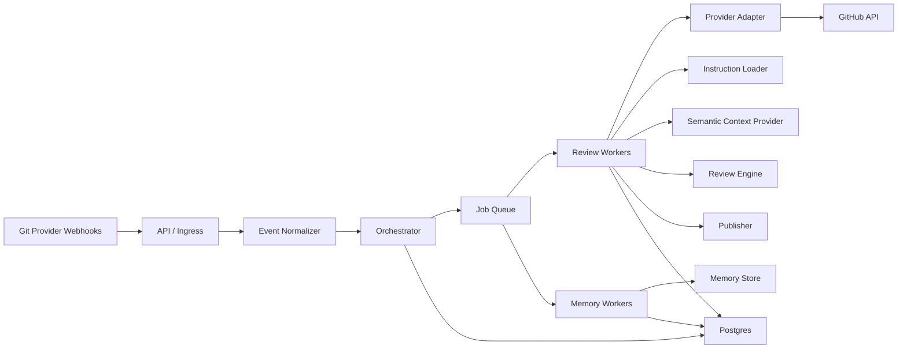

# nitpickr Architecture Plan

## 1. Product Goal

`nitpickr` is a multi-tenant AI code review service that connects to Git providers and reviews pull requests or merge requests. It should:

- review diffs and post inline comments
- publish a summary comment
- generate a Mermaid graph describing the flow of the change
- read repository-specific instructions from the codebase
- include actionable AI fix prompts in comments
- support manual triggers through mentions or commands
- learn from PR discussions and reuse relevant memory later
- stay fast enough to feel interactive

The first provider is GitHub. The architecture must allow GitLab and Bitbucket to be added later without rewriting the core.

## 2. Core Principles

- GitHub first, provider-agnostic core
- multi-tenant from day one
- async review pipeline
- diff-first analysis in v1
- AST-ready interfaces for future semantic analysis
- strict isolation of tenant data, memory, and performance budgets
- stateless API services and horizontally scalable workers

## 3. High-Level Architecture



## 4. Main Components

### 4.1 API / Ingress

Responsibilities:

- receive GitHub App webhooks
- verify webhook signatures
- normalize incoming events
- accept comment-based commands and manual triggers
- persist idempotent event records
- enqueue work and return quickly

Notes:

- keep this service stateless
- never do full review work in the webhook request path

### 4.2 Orchestrator

Responsibilities:

- decide whether a review should run
- dedupe events
- cancel obsolete runs when a new commit arrives
- create `review_runs` and `review_chunks`
- enforce review budgets and trigger policies

### 4.3 Review Workers

Responsibilities:

- fetch changed files and diff hunks
- load repository instructions
- retrieve relevant memory
- build chunked review requests
- call OpenAI
- merge findings into one review result
- hand results to the publisher

### 4.4 Memory Workers

Responsibilities:

- ingest PR comments, replies, and resolutions
- classify whether feedback should become memory
- store accepted patterns, false positives, and team conventions
- update memory confidence and recency

### 4.5 Provider Adapter

The provider adapter isolates GitHub-specific behavior from the core.

GitHub adapter responsibilities:

- map webhook payloads into internal events
- fetch PR metadata, changed files, diffs, comments, and threads
- post inline review comments
- post summary comments
- update status checks
- resolve or supersede prior bot reviews

Later adapters:

- GitLab
- Bitbucket

## 5. Provider-Agnostic Domain Model

Core entities:

- `Tenant`
- `Installation`
- `Repository`
- `ChangeRequest`
- `ReviewTrigger`
- `ReviewRun`
- `ReviewChunk`
- `ReviewFinding`
- `DiscussionEvent`
- `MemoryEntry`

Notes:

- GitHub pull requests, GitLab merge requests, and Bitbucket pull requests should all map into `ChangeRequest`
- provider-specific IDs should be stored, but the core logic should operate on neutral types

## 6. Multi-Tenant Design

The initial user may be one person, but the architecture should treat this as a real SaaS from day one.

Tenant isolation keys:

- `tenant_id`
- `installation_id`
- `repository_id`

Rules:

- memory never crosses tenant boundaries by default
- config is scoped to tenant and repository
- usage, rate limits, and budgets are tracked per tenant
- reviews from one tenant must not block another tenant indefinitely

Recommended tenant model:

- v1: tenant maps to GitHub App installation
- later: tenant can represent a user workspace or organization

## 7. Performance Strategy

The main latency sources will be Git provider APIs, prompt construction, and LLM round trips. The architecture should reduce work before trying to optimize runtime language details.

### 7.1 Fast Path

1. receive webhook
2. persist event
3. enqueue review job
4. fetch changed files and hunks only
5. load cached instructions and memory
6. split work into chunks
7. review chunks in parallel with bounded concurrency
8. merge findings
9. publish summary and inline comments

### 7.2 Performance Rules

- review changed files only
- review changed hunks only
- add small surrounding context instead of full-file context by default
- cache repository instructions by commit SHA or config hash
- cache file summaries and metadata by blob SHA
- reuse prior review state when commits are incremental
- cap files, hunks, tokens, comments, and runtime per review
- support a quick review mode and a full review mode
- cancel stale runs when a newer commit is pushed

### 7.3 Queue Fairness

To avoid one user harming another:

- apply per-tenant concurrency limits
- apply per-repo dedupe rules
- use weighted fair scheduling
- prioritize explicit user-triggered reviews over background reviews
- keep separate budgets for Git provider API calls and model usage

## 8. AST-Ready Design

AST is deferred, but the architecture should make future integration straightforward.

Create a semantic seam now:

```ts
interface SemanticContextProvider {
  getContext(input: {
    repositoryId: string;
    baseSha: string;
    headSha: string;
    filePath: string;
    hunks: DiffHunk[];
  }): Promise<SemanticContext>;
}
```

V1 implementation:

- enclosing diff-local context
- nearby imports and declarations when cheaply available

Future implementation:

- AST symbol extraction
- impacted function or class boundaries
- imports and type dependencies
- call graph hints
- richer Mermaid graph generation

The orchestrator and review engine should depend on the interface, not on AST logic directly.

## 9. Review Flow

### Inputs

- diff hunks
- file metadata
- repository instructions
- recent review history
- relevant memory
- trigger type

### Outputs

- inline comments
- summary comment
- Mermaid flow graph
- fix prompts for the author
- status check result

### Review Modes

- automatic review on PR open or update
- manual review through mention or command
- full review for deeper analysis
- summary-only mode for very large PRs

## 10. Instructions and Repository Guidance

Support repository guidance through:

- `.nitpickr.yml`
- `.nitpickr/`
- `AGENTS.md`
- optional provider-specific fallback files later

The instruction loader should support:

- global review rules
- path-specific instructions
- ignore patterns
- comment budgets
- trigger settings
- strictness level
- project-specific remediation preferences

## 11. Memory and Learning

Memory should be structured, not an unbounded chat transcript.

Memory types:

- accepted recommendations
- rejected recommendations
- known false positives
- preferred coding patterns
- team conventions
- path-specific preferences

Memory retrieval should be filtered by:

- tenant
- repository
- file path or language
- recency
- confidence

Suggested approach:

- ingest discussion events asynchronously
- classify whether the event contains reusable guidance
- store concise, structured memory entries
- retrieve a small set of relevant memories during future reviews

## 12. Trigger Model

GitHub v1 triggers:

- PR opened
- PR synchronized
- PR marked ready for review
- comment mention such as `@nitpickr review`
- label-based trigger later if needed

Recommended commands:

- `@nitpickr review`
- `@nitpickr full review`
- `@nitpickr summary`
- `@nitpickr recheck`
- `@nitpickr ignore this`

The core should store a provider-neutral trigger representation so GitLab and Bitbucket can map to it later.

## 13. Data Model

Initial tables:

- `tenants`
- `installations`
- `repositories`
- `repo_configs`
- `change_requests`
- `review_runs`
- `review_chunks`
- `review_findings`
- `published_comments`
- `discussion_events`
- `memory_entries`
- `usage_counters`
- `job_records`

Important keys:

- tenant boundary: `tenant_id`
- repo boundary: `repository_id`
- review identity: `change_request_id + head_sha + trigger_type`

## 14. Deployment Strategy

### Recommended deployment shape

- one codebase
- one container image
- separate `api` and `worker` processes
- managed Postgres
- optional Redis later
- CI/CD through GitHub Actions

### Platforms

Strong options:

- Railway for founder-friendly early deployment
- Render for simple service plus worker hosting
- Cloud Run for stronger long-term scaling controls

Recommended path:

- start on Railway or Render for speed
- keep the app containerized and stateless
- retain a migration path to Cloud Run later if scale or tenant isolation requirements increase

### Scaling model

- scale `api` replicas independently from `worker` replicas
- keep workers horizontally scalable
- tune concurrency with per-tenant caps
- move to dedicated worker pools for large tenants later if needed

## 15. Technology Choices

Recommended default stack:

- TypeScript / Node.js for API, orchestration, and workers
- Postgres for state and durable data
- Docker for packaging
- GitHub Actions for CI/CD

Why Node is acceptable:

- most work is I/O-bound
- webhook and API orchestration are a good fit
- strong TypeScript interfaces support provider and AST seams

Planned extension point:

- add Go or Python analyzer workers later if deeper semantic analysis becomes CPU-heavy

## 16. Release Roadmap

### Phase 1: MVP

- GitHub App webhook ingestion
- PR diff fetching
- inline comments
- summary comment
- Mermaid graph output
- repository instructions
- manual trigger with mention

### Phase 2: Usability and speed

- queue fairness
- stale-run cancelation
- quick review vs full review modes
- caching and chunk reuse
- comment budget controls

### Phase 3: Learning

- discussion ingestion
- structured memory extraction
- memory retrieval in future reviews
- reviewer quality controls and false-positive suppression

### Phase 4: Product hardening

- feature flags
- usage metering
- tenant-level settings
- improved observability
- stronger deployment automation

### Phase 5: Expansion

- GitLab adapter
- Bitbucket adapter
- AST-backed semantic context
- dedicated tenant worker pools
- enterprise deployment options

## 17. Immediate Next Steps

1. Create the TypeScript monorepo or service layout.
2. Define the provider-agnostic domain types and interfaces.
3. Implement the GitHub adapter first.
4. Build the async review pipeline with a Postgres-backed queue.
5. Implement repository instruction loading.
6. Implement the OpenAI review contract with structured outputs.
7. Add publishing for inline comments, summary comments, and status checks.
8. Add memory ingestion and retrieval.
9. Add observability, budgets, and concurrency controls.

## 18. Open Decisions

These should be resolved before implementation starts in earnest:

- exact deployment target for v1: Railway or Render
- Postgres-backed queue first, or Redis-backed queue from the start
- exact `.nitpickr.yml` schema
- whether summary comments should be replaced or appended on reruns
- initial memory retention policy
- whether Mermaid generation should be mandatory on every review or adaptive based on PR size
